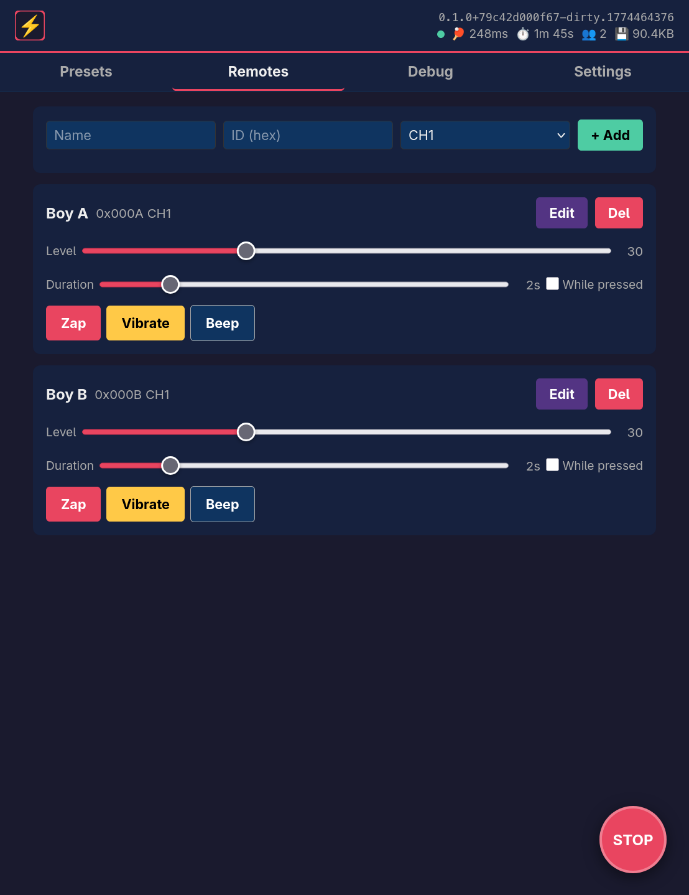
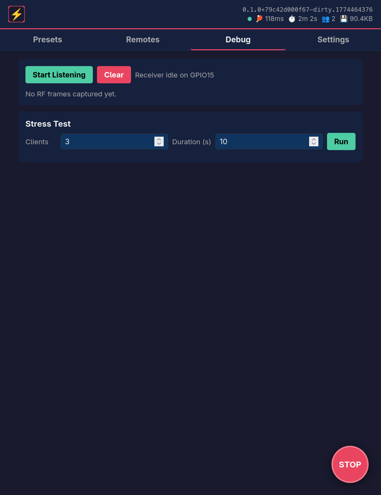
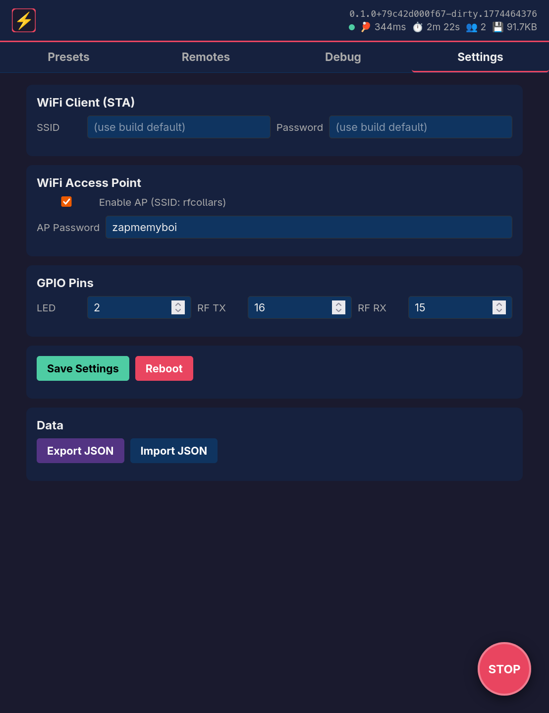

# rusty-collars

ESP32 firmware for controlling CaiXianlin 433 MHz RF shock collars over WiFi. Runs a web UI with WebSocket-based real-time control, preset sequencing, and RF debugging tools.

Supported targets: ESP32, ESP32-C6, ESP32-P4.

## WARNING

**This project is intended exclusively for use with animal training collars on pets, under proper supervision.** Never use shock collars or similar devices on humans. Misuse can cause serious injury or death.

## Screenshots

| Remotes | Presets | Debug | Settings |
|---------|---------|-------|----------|
|  |  |  |  |

## References

See [OpenShock](https://wiki.openshock.org/) for additional details.
